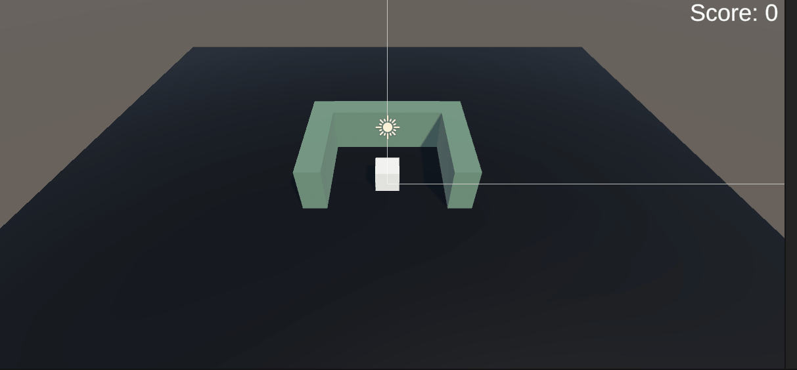
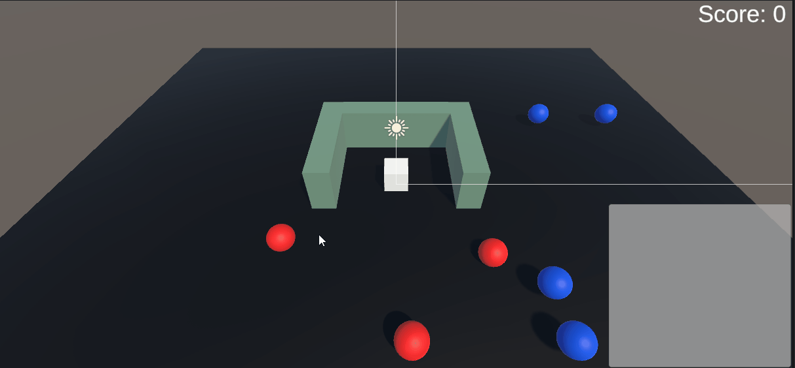
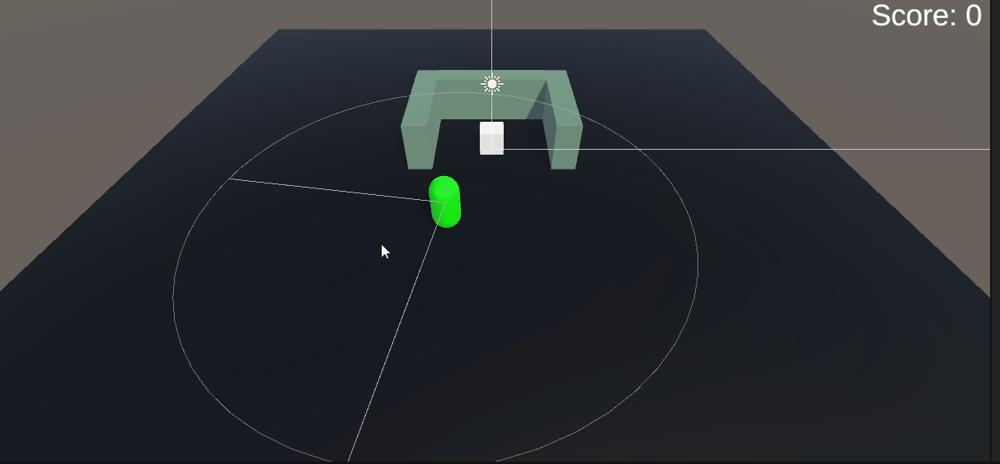
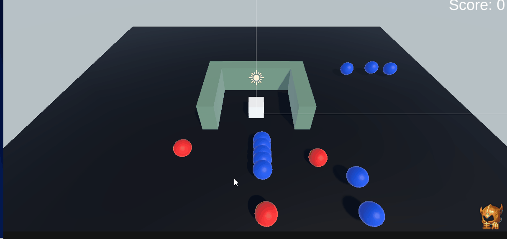
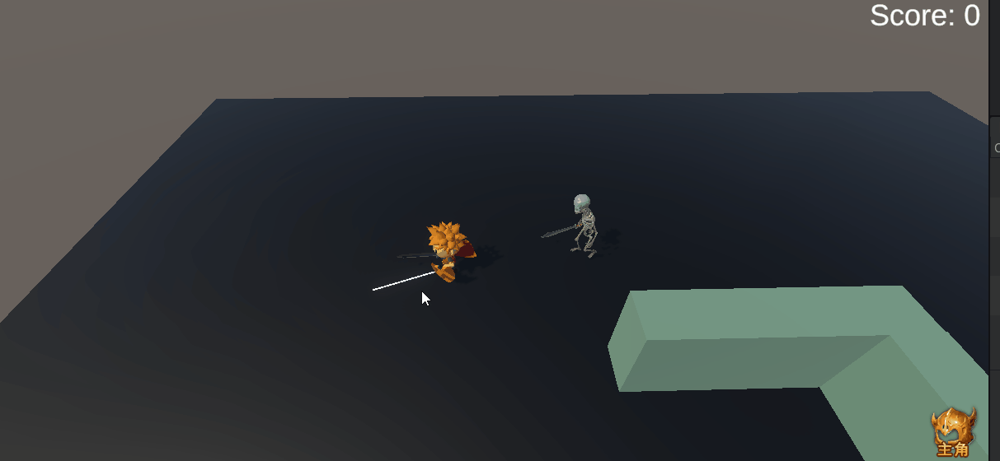

# 🥋 Unity Training Dojo (Unity 实战训练场)

> 这是一个用于练习 Unity 核心机制、架构设计与算法实现的工程项目。
> 项目包含多个独立的功能模块，每个模块都针对特定的技术难点进行了深入实践。

---

## 📚 目录 (Table of Contents)
1. [RTS 风格移动与命令系统](#1-rts-风格移动与命令系统-command--navigation)
2. [MVC 架构背包系统](#2-mvc-架构背包系统-inventory-system)
3. [智能 AI 与感知系统](#3-智能-ai-与感知系统-ai-perception--fsm)
4. [UI 动效与反馈](#4-ui-动效与反馈-ui-motion--feedback)

---

## 1. RTS 风格移动与命令系统 (Command & Navigation)

<div align="center">
  <!-- 请确保你的 Docs 文件夹里有这张图，名字要对应 -->
  
</div>

### 1.1 系统概述 (Overview)
本模块实现了一个类似 MOBA/RTS 游戏的点击移动系统。
集成了 **Unity NavMesh 智能寻路** 与 **自定义命令队列**，支持路径预判与连续指令。同时实现了基于 **观察者模式** 的事件解耦和基于 **对象池** 的高性能特效管理。

### 1.2 核心技术点
*   **算法应用**：使用 `Queue<Vector3>` 实现 **FIFO (先进先出)** 的命令队列，解决连续点击时的路径覆盖问题。
*   **路径可视化**：动态合并 `NavMeshAgent.path.corners` (当前路径) 与 `moveQueue` (未来路径)，使用 `LineRenderer` 绘制完整的预判轨迹。
*   **性能优化**：使用基于 `Stack` 的 **对象池 (Object Pool)** 管理点击特效，利用 CPU 缓存热度 (Cache Locality)，实现 Zero GC。
*   **架构设计**：使用 **观察者模式** 解耦玩家与场景交互，使用 **单例模式** 管理全局计分状态。

### 1.3 关键类设计
*   **`CommandMove`**：核心控制器。引入 `isWalking` 状态位，精确捕捉“到达目的地”的瞬间，解决触发时机错位 Bug。
*   **`FXManager`**：特效管理器。维护 `Stack<GameObject>` 池子，负责特效的借出与回收。

---

## 2. MVC 架构背包系统 (Inventory System)

<div align="center">
  <!-- 请确保你的 Docs 文件夹里有这张图，名字要对应 -->
  
</div>

### 2.1 系统概述 (Overview)
本模块实现了一个基于 **MVC 架构** 的库存系统。实现了数据的配置化（ScriptableObject）、逻辑的单例管理以及 UI 的事件驱动更新。

### 2.2 核心架构图 (Architecture)

> **数据流向 (Unidirectional Data Flow)**
>
> `ItemPickup` (玩家触碰) -> `InventoryManager` (修改数据) -> **Event: OnInventoryChanged** (广播) -> `InventoryUI` (刷新界面)

### 2.3 关键类设计 (Class Design)

#### 📄 ItemData (ScriptableObject)
*   **作用**：存储物品的静态配置信息（ID、Icon、Name、Stackable）。
*   **设计理由**：使用 SO 实现了**数据与逻辑分离**。方便策划在编辑器中批量配置数据，且 SO 资源在内存中只存一份，不占用额外的 Runtime 内存。

#### ⚙️ InventoryManager (Model + Controller)
*   **作用**：作为核心管理器，使用 `List<InventorySlot>` 维护运行时库存数据。
*   **核心方法**：`AddItem(data, amount)`。
*   **设计思路**：实现了**智能堆叠**逻辑。当添加物品时，先遍历查找背包中是否存在相同的可堆叠物品；若存在则增加数量，否则创建新格子。

#### 🖼️ InventoryUI (View)
*   **作用**：观察者模式的订阅者，负责渲染界面。
*   **核心机制**：在 `Start` 中订阅事件，在 `OnDestroy` 中注销事件。
*   **设计理由**：采用**事件驱动 (Event-Driven)** 更新。UI 不需要每帧在 `Update` 中轮询数据，只有当数据真正改变时才被动刷新。这不仅实现了逻辑解耦，也最大化了性能。

---
## 3. 智能 AI 与感知系统 (AI Perception & FSM)

<div align="center">
  
</div>

### 3.1 系统概述 (Overview)
构建了一个基于 **有限状态机 (FSM)** 的 AI 系统，赋予 NPC 巡逻、追击、攻击的行为模式。
核心亮点在于实现了 **拟真的视觉感知 (Sensory System)**，AI 拥有扇形视野，且视线会被障碍物遮挡，不再是简单的距离检测。

### 3.2 核心数学与逻辑(Math & Logic)

#### 👁️ 视觉感知 (Vision Sensor)
AI的“视觉感知”不依赖Update每帧进行检测，通过协程 **每0.2s** 进行一次低频扫描，优化性能。检测逻辑分为三步：
1. **范围检测**：
*    使用 `Physics.OverlapSphere` 获取视距范围内所有潜在目标（利用`LayerMask`过滤无关的物体）。
2. **角度检测 (Angle Detection)**：
  *   **方案一：基础做法 (Standard)**
        *   使用 `Vector3.Angle` 直接计算 `transform.forward` 与 `dirToTarget` 的夹角。
        *   若夹角小于 `viewAngle/2`，则判定在视野内。
  *   **方案二：性能优化 (Optimization) [当前采用]**
        *   **原理**：放弃开销较大的 `Vector3.Angle` (内部涉及 `Acos` 反三角函数)，改用 **点乘 (Dot Product)**。
        *   **算法**：计算 `Vector3.Dot(transform.forward, dirToTarget)`。
        *   **判定**：若点乘结果 **大于** 视野半角的余弦值 (`Mathf.Cos(angle/2)`)，即判定在扇形范围内。
        *   *(扩展：使用 **叉乘 (Cross Product)** 判断目标位于左侧还是右侧，用于方位分析)*
3. **遮挡检测**：
*   向目标发出 **射线(Raycast)**
*   若射线在触碰目标前先击中了 `Obstacle` 层（墙壁），则判定视线被遮挡，无法看见。

#### 🧠 状态机架构 (FSM Architecture)
*   **结构设计**：采用 `IState` 接口定义状态行为 (`OnEnter`, `OnUpdate`, `OnExit`)，通过通用的 `StateMachine` 类管理切换。
*   **性能优化**：
    *   在 `Awake` 阶段预先实例化所有状态对象（`PatrolState`, `ChaseState`, `AttackState`）。
    *   运行时仅切换引用，**避免了频繁 `new` 状态对象导致的内存垃圾 (Garbage)**。

---

## 4. UI 动效与反馈 (UI Motion & Feedback)
<div align="center">
  
</div>

### 4.1 系统概述 (Overview)
引入 **DOTween** 插件，将原本的 UI 交互升级动态交互。
重点实现了 **非线性动画 (Easing)**、**屏幕空间映射** 以及 **交互防抖** 机制，提升了视觉体验。

### 4.2 核心技术点 (Technical Highlights)
#### 🎨 动画与交互 (Animation & Interaction)
* **弹窗动画**： 使用 `DOScale` 配合 `Ease.OutBack` (回弹曲线)，实现背包面板的 Q 弹开关效果。
*   **飞行轨迹**：实现物品从“3D世界”到“2D UI”的飞行动画。
    *   使用 `Camera.WorldToScreenPoint` 进行坐标转换。
    *   利用 `OnComplete` 回调，确保动画播放完毕后才刷新数据，保证视觉逻辑的连贯性。
*   **交互防抖**：在所有 UI 动画前调用 `DOKill()`，防止玩家高频操作（如疯狂按开关键）导致动画状态错乱或鬼畜。

#### 🏗️ 架构调整 (Architecture Support)
为了配合动画表现，对 MVC 架构进行了微调：
*   **静默添加模式 (Silent Mode)**：
    *   重载 `InventoryManager.AddItem` 方法，增加 `autoUpdateUI` 参数。
    *   允许在播放动画时暂时挂起 UI 刷新，待动画结束后手动刷新，解决了“动画未到，数据先变”的穿帮问题
#### ⚡ 性能优化：列表智能刷新 (Smart Refresh)
重构了背包列表的刷新逻辑，放弃了低效的“全删全建”方式，采用 **差量更新** 策略：
1.  **复用 (Reuse)**：优先使用现有的 UI 格子，仅更新图标和数字。
2.  **增补 (Add)**：仅在数据量 > 格子量时实例化新格子。
3.  **裁剪 (Trim)**：仅在数据量 < 格子量时销毁多余格子。
*   **结果**：将 UI 刷新的 **GC 和 CPU 开销降至最低**，即使每秒捡起 10 个物品也不会卡顿。
#### 🚀 C# 扩展方法与链式编程
利用 DOTween 的链式 API 实现复杂的序列动画：

```csharp
flyIcon.transform
    .DOMove(targetPos, 0.8f)       // 1. 移动
    .SetEase(Ease.InBack)          // 2. 设置蓄力曲线
    .OnComplete(() =>              // 3. 动画结束回调
    {
        Destroy(flyIcon);          // 销毁临时图标
        bagButton.DOKill(true);    // 停止旧震动
        bagButton.DOShakeAnchorPos(0.2f, 10); // 按钮震动反馈
        RefreshUI();               // 手动刷新数据
    });
```

### 5. 重构核心架构

### 5.1 输入系统重构(New Input System)
使用Unity **New Input System** 代替旧版的`Input.GetMouseButton`的轮询模式
* **设计模式**：采用**事件驱动 (Event-Driven)**。
* **实现**：封装`InputManager`单例，将底层的`InputAction`映射为C#事件（`OnClick`）和属性（`MousePosition`）,供上层逻辑调用。

### 5.2 玩家控制 FSM 化 (Player State Machine)
将 `PlayerController` 重构为与 AI 同构的 **有限状态机 (FSM)**，实现了逻辑解耦与状态复用。

*   **PlayerController (核心中枢)**：
    *   **职责**：作为“黑板”持有组件引用，并负责**输入事件的分发**。
    *   **逻辑**：订阅 `InputManager.OnClick` 事件，执行射线检测。根据点击目标（地面 vs 敌人），**动态决策**是切换到移动状态还是攻击状态。
*   **IdleState (待机)**：
    *   **职责**：负责状态重置。进入时清空路径并停止动画，保持静止以等待指令。
*   **MoveState (移动)**：
    *   **职责**：驱动 `NavMeshAgent` 执行寻路，同步 BlendTree 动画参数。
    *   **特性**：实现了到达检测逻辑，并实时调用 `LineRenderer` 绘制路径轨迹。
*   **AttackState (攻击)**：
    *   **职责**：负责战斗定位（LookAt 锁定目标）与攻击冷却计时，触发攻击动画。

### 5.3 数据驱动设计(Data-Driven Gameplay)
引入`ScriptableObject`作为数据配置中心，实现**数据与逻辑分离**。
*   **CharacterStats**：定义了 HP、移动速度、攻击间隔、侦查范围等属性。
*   **应用**：Player 和 Enemy 均持有 Stats 引用。可在编辑器中直接调整数值，无需修改代码，实现了“热插拔”式的数值调整。

---
### 6. 视觉效果升级

<div align="center">
  <!-- 请确保你的 Docs 文件夹里有这张 GIF，名字要对应 -->
  
</div>

### 6.1 渲染管线升级 (URP Upgrade)
项目升级至 **Universal Render Pipeline (URP)**，以支持 Shader Graph 开发与高性能后处理。
### 6.2 敌人死亡溶解特效 (Dissolve Shader)
使用 **Shader Graph** 制作了基于噪声的动态溶解效果。

#### 🧪 核心算法原理
利用 **佩林噪声 (Perlin Noise)** 的连续性特征，通过两次二值化提取“等高线”作为燃烧边缘。
1.  **地形模拟**：将噪声图视为高度图 (0=谷底, 1=山峰)。
2.  **边缘计算**：利用 `Step(Noise, Amount)` - `Step(Noise, Amount + 0.05)` 的减法运算，精准提取出宽度为 0.05 的**数值过渡带**。
3.  **色彩叠加**：将提取出的边缘乘以 **HDR 高亮颜色**，配合 Bloom 产生燃烧余烬的视觉效果。

### 6.3 镜头跟随 (Cinemachine)
引入 **Cinemachine** 替代原生相机。
*   **模式**：使用 `Framing Transposer` 实现 RTS/MOBA 风格的上帝视角。
*   **特性**：配置 **Dead Zone (死区)** 与 **Damping (阻尼)**，过滤掉玩家微操作带来的画面抖动，实现平滑镜头跟随。

## 7. 可扩展技能系统 (Scalable Skill System)
<div align="center">
  
</div>

## 7.1 系统概述（Overview）
基于 **策略模式（Strategy Pattern）** 构建了一套可高度扩展的技能架构。
系统支持**数据驱动**的技能配置（冷却、图标、前摇），并实现**逻辑与表现的严格同步。

## 7.2 核心架构设计（Design Patterns）

### 策略模式 (The Strategy Pattern)
为了遵循 **开闭原则 (OCP)**，将技能的具体行为封装为独立的策略类。
* **抽象基类** ：`SkillStrategy`(继承自 ScriptableObject)。
* **具体策略**：
    *   `DirectDamageStrategy`：锁定目标，直接造成伤害。
    *   *(扩展预留)* `ProjectileStrategy`：发射物理投射物。
    *   *(扩展预留)* `AOEStrategy`：范围爆炸伤害。
*   **优势**：新增技能只需编写新的策略脚本并创建资产，无需修改 `PlayerSkillManager` 的核心代码。

### 数据结构
#### 💾 数据结构 (Data Structure)
*   **`SkillData` (配置)**：存储静态数据（图标、CD时间、动作类型、策略引用）。
*   **`SkillSlot` (运行时)**：包装 `SkillData`，负责维护当前的 **冷却倒计时 (Cooldown)**。
*   **`PlayerSkillManager` (管理器)**：维护 `List<SkillSlot>`，监听输入并执行技能释放流程。
#### ⚙️ PlayerSkillManager (系统中枢)
*   **作用**：挂载于玩家身上的核心组件，作为 **Controller** 角色协调各模块工作。
*   **核心职责**：
    1.  **输入响应 (Input Handling)**：订阅 `InputManager` 事件（如按 Q 键），将硬件输入转化为游戏指令。
    2.  **冷却管理 (Cooldown System)**：在 `Update` 中驱动所有 `SkillSlot` 的冷却倒计时，确保技能循环的合法性。
    3.  **流程协调 (Orchestration)**：
        *   **前置检查**：判断冷却状态、搜索并锁定目标。
        *   **状态接管**：调用 `PlayerController.SwitchState` 进入施法状态。
        *   **后置处理**：技能释放成功后重置冷却。

### 7.3 战斗手感优化 (Combat Polish)
为了解决动作游戏中常见的滑步与不同步问题，引入了专门的 **施法状态 (CastState)**。

*   **状态锁定**：进入 `CastState` 时强制 `agent.ResetPath()` 并锁定输入，防止施法滑步。
*   **动画同步**：利用 `SkillData` 中的 `castDelay` 参数配合协程，精确控制伤害/特效触发时机，使其与动画挥砍的关键帧对齐。


## 🛠️ 开发环境
*   **Engine**: Unity 2021.3 LTS (或你的版本)
*   **Language**: C#
*   **IDE**: Visual Studio 2022
*   **Tools**: Git, ScreenToGif